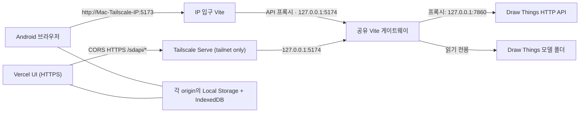

# Draw Things Local Canvas

Draw Things macOS의 HTTP API를 같은 Mac에서 실행되는 웹 게이트웨이가 중계하는 로컬 우선 AI 이미지 캔버스입니다. Android에서는 Mac의 Tailscale IP로 접속하거나, Vercel 화면에서 Tailscale Serve HTTPS 게이트웨이를 지정해 접속합니다. 프롬프트와 생성 이미지는 애플리케이션 백엔드로 전송되지 않습니다.

이 프로젝트의 API 매핑과 제약은 Draw Things `v1.20260716.0` (`64646d1202441d6abe17498caa02316669c3fc31`)을 기준으로 확인했습니다. Draw Things 공식 제품이나 공식 웹 클라이언트는 아닙니다.

## 현재 구조



Tailscale IP로 연 화면은 같은 origin의 `/sdapi`를 호출합니다. Vercel 화면은 사용자가 그 브라우저에만 저장한 `https://<Mac>.<tailnet>.ts.net` 게이트웨이에 CORS HTTPS 요청을 보냅니다. 두 경로는 루프백의 공유 게이트웨이 하나로 합쳐져 `http://127.0.0.1:7860`으로 전달하므로 생성 잠금이 일관되게 적용됩니다.

Vercel은 정적 UI만 제공합니다. Vercel 서버가 Mac으로 요청을 중계하지 않으며, API 요청은 Android 브라우저에서 Tailscale을 통해 Mac으로 직접 이동합니다. 따라서 Vercel 주소에서 생성하려면 Mac의 **Tailscale Serve HTTPS** 설정과 화면의 게이트웨이 URL 저장이 모두 필요합니다.

## 기능

- 여러 로컬 세션을 가진 무한 캔버스: 이동, 확대/축소, 전체 맞춤, 이미지 가져오기
- Draw Things HTTP `txt2img`와 `img2img`
- 선택한 캔버스 이미지를 다음 생성의 입력으로 사용하는 변형 흐름
- 같은 세션의 이전 프롬프트를 이어 붙이는 클라이언트 측 대화 문맥
- 모델, 샘플러, 크기, 스텝, CFG, 시드, SDXL, refiner, 고해상도 보정, 타일링, LoRA, Control, 업스케일, 텍스트 인코더, TeaCache 등 HTTP API 생성 설정
- `/sdapi/v1/options`의 현재 모델과 로컬 모델 메타데이터를 합친 설치 모델 드롭다운
- 5초 간격 연결 감시, 탭 복귀 시 즉시 확인, 생성 직전 재검사
- 설정은 Local Storage 시작 캐시와 IndexedDB revision 트랜잭션에, 캔버스 세션과 이미지는 IndexedDB에 로컬 저장

## 요구 사항

- macOS와 Draw Things `v1.20260716.0` 또는 호환 버전
- Node.js `22.12.0` 이상
- pnpm `10.33.0`
- Mac과 Android에 로그인된 Tailscale

```sh
node --version
pnpm --version
/Applications/Tailscale.app/Contents/MacOS/Tailscale version
```

## Draw Things 설정

Draw Things의 설정에서 API 서버를 다음과 같이 맞춥니다.

| 옵션 | 값 | 이유 |
| --- | --- | --- |
| API 서버 | 켬 / Online | 웹 서버의 상태 확인과 생성을 받습니다. |
| 프로토콜 | `HTTP` | 브라우저 클라이언트가 사용하는 공개 API입니다. |
| IP | `127.0.0.1` | Draw Things 자체를 LAN이나 tailnet에 직접 노출하지 않습니다. |
| 포트 | `7860` | Vite 프록시의 고정 대상입니다. |
| TLS | 끔 | Mac 내부 루프백 통신입니다. |

포트·호스트·HTTP TLS를 다르게 사용하려면 실행할 때 서버 측 환경 변수로 origin을 지정합니다.

```sh
DRAW_THINGS_API_ORIGIN=https://127.0.0.1:7861 pnpm dev
```

자체 서명 인증서를 쓰는 로컬 HTTPS API라면 신뢰할 인증서를 설치하는 것이 우선입니다. 테스트 목적으로만
`DRAW_THINGS_API_TLS_VERIFY=false`를 함께 지정할 수 있습니다. 브라우저가 직접 네이티브 gRPC를 호출할
수는 없으므로 이 단순 서버는 Draw Things의 HTTP 모드만 지원합니다.

기본 sandbox 밖의 모델 폴더도 읽어야 한다면 쉼표로 구분한 절대 경로를 서버 환경에 추가할 수 있습니다.

```sh
DRAW_THINGS_MODEL_DIRECTORIES="/absolute/Models,/Volumes/Models" pnpm preview
```

## Mac에서 실행

의존성을 설치합니다.

```sh
pnpm install --frozen-lockfile
```

Mac에서만 개발할 때는 다음으로 충분합니다.

```sh
pnpm dev
```

기본 주소는 `http://127.0.0.1:5173`입니다. 이 상태에서는 다른 기기에 포트가 열리지 않습니다.

## Tailscale로 Android에서 접속

프로덕션 빌드를 만든 뒤 공유 Vite preview는 **Mac 루프백**에, 기존 IP 화면용 Vite preview는 **Mac의 Tailscale IP**에 바인딩합니다. IP 입구는 API를 공유 게이트웨이로만 전달하고, Tailscale Serve는 공유 게이트웨이의 HTTPS 입구가 됩니다. 이로써 기존 Tailscale IP URL을 유지하면서 Vercel HTTPS 화면도 같은 생성 잠금을 사용합니다.

```sh
pnpm build
DRAW_THINGS_TAILSCALE_IP=$(/Applications/Tailscale.app/Contents/MacOS/Tailscale ip -4)
DRAW_THINGS_TAILSCALE_DNS=$(/Applications/Tailscale.app/Contents/MacOS/Tailscale status --json | jq -r '.Self.DNSName | rtrimstr(".")')
DRAW_THINGS_ALLOWED_HOSTS="$DRAW_THINGS_TAILSCALE_DNS" \
DRAW_THINGS_ALLOWED_ORIGINS="https://draw-things-web.vercel.app" \
pnpm preview \
  --host 127.0.0.1 \
  --port 5174 \
  --strictPort
```

다른 터미널에서 기존 IP 주소용 입구를 실행합니다. `DRAW_THINGS_ANDROID_TAILSCALE_IP`에는 Android의 실제 Tailscale IP를 넣으세요.

```sh
DRAW_THINGS_ANDROID_TAILSCALE_IP=100.64.0.2
DRAW_THINGS_API_ORIGIN=http://127.0.0.1:5174 \
DRAW_THINGS_ALLOWED_CLIENTS="$DRAW_THINGS_ANDROID_TAILSCALE_IP" \
DRAW_THINGS_ALLOWED_HOSTS="$DRAW_THINGS_TAILSCALE_IP" \
pnpm preview --host "$DRAW_THINGS_TAILSCALE_IP" --port 5173 --strictPort
```

마지막으로 Tailscale Serve HTTPS를 설정합니다. 이 명령은 공개 인터넷용 Funnel이 아니라 **같은 tailnet 안에서만** 동작합니다.

```sh
/Applications/Tailscale.app/Contents/MacOS/Tailscale serve --bg --https=443 5174
/Applications/Tailscale.app/Contents/MacOS/Tailscale serve status
```

처음 HTTPS를 켤 때 Tailscale이 인증서 활성화 동의 링크를 표시할 수 있습니다. 표시된 안내를 완료하면 두 주소가 준비됩니다.

Android에서 다음 주소를 엽니다.

```text
http://<Mac의-Tailscale-IP>:5173
```

예를 들어 Mac IP가 `100.121.194.59`라면 `http://100.121.194.59:5173`입니다. 별도의 API 주소나 인증 값을 입력하지 않아도 화면이 열리면 자동으로 `/sdapi/v1/options`를 검사합니다.

이 HTTP 주소는 기존 방식과 호환됩니다. IP 입구의 API 요청은 루프백의 공유 Vite 게이트웨이로 전달되므로, IP와 HTTPS 경로가 동시에 열려도 생성 잠금은 공유됩니다.

Vercel 화면에서 생성하려면 Android의 Tailscale을 켠 뒤 `https://draw-things-web.vercel.app`을 열고 **API 상태**에서 Serve가 표시한 HTTPS 주소(예: `https://hshim.taila7bd14.ts.net`)를 저장합니다. URL은 이 Vercel origin의 Local Storage/IndexedDB에만 저장되며, 백업 파일에는 포함되지 않습니다. 저장 후 연결 상태가 즉시 확인되고 이후 5초마다 감시됩니다.

Vercel 화면이 CORS 요청을 보낼 수 있는 주소는 `DRAW_THINGS_ALLOWED_ORIGINS`로 제한됩니다. 추가 Vercel preview 주소를 허용해야 한다면 해당 HTTPS origin을 쉼표로 추가하세요.

```sh
DRAW_THINGS_ALLOWED_ORIGINS="https://draw-things-web.vercel.app,https://preview.example.vercel.app" pnpm preview --host 127.0.0.1 --port 5174 --strictPort
```

Tailscale Serve는 실제 Android IP 대신 Mac 루프백에서 공유 게이트웨이에 연결하므로 HTTPS 경로에서는 `DRAW_THINGS_ALLOWED_CLIENTS`로 Android를 식별할 수 없습니다. Android만 접근하게 하려면 Tailscale 관리 콘솔의 ACL/grant에서 Android 사용자·기기에서 이 Mac의 TCP `5173`과 HTTPS Serve 접근만 허용하세요. MagicDNS 이름은 공유 게이트웨이, Tailscale IP는 IP 입구의 `DRAW_THINGS_ALLOWED_HOSTS`에 각각 넣어 DNS rebinding을 막습니다.

연결되지 않을 때는 다음을 확인합니다.

1. Android와 Mac이 같은 tailnet에서 온라인인지 확인합니다.
2. Draw Things가 `HTTP / 127.0.0.1 / 7860`으로 실행 중인지 확인합니다.
3. preview 터미널이 계속 실행 중인지 확인합니다.
4. 제한적인 Tailscale ACL/grant를 사용한다면 Android에서 Mac의 TCP `5173`과 HTTPS Serve 접근을 허용합니다.
5. Vercel에서 연결할 때는 API 상태에 `https://<Mac>.<tailnet>.ts.net`을 저장했는지 확인합니다.

`--host 0.0.0.0`은 Wi-Fi와 유선 LAN에도 서버를 노출하므로 사용하지 마십시오. 공유 게이트웨이는 `127.0.0.1`에만 바인딩하고, 인터넷 공유기 포트 포워딩이나 Funnel도 사용하지 않습니다.

## Vercel 배포

Vercel에는 서버 함수가 없는 Vite 정적 앱만 배포됩니다. 생성 요청은 Vercel을 통과하지 않고, 사용자의 Android 브라우저가 저장한 Tailscale Serve HTTPS 주소로 직접 보냅니다.

| Vercel 설정 | 값 |
| --- | --- |
| Framework Preset | Vite |
| Install Command | `pnpm install --frozen-lockfile` |
| Build Command | `pnpm build` |
| Output Directory | `dist` |
| Node.js | `22.12.0` 이상 |

```sh
pnpm dlx vercel
pnpm dlx vercel --prod
```

`vercel.json`은 `/sdapi`와 `/local-api` 요청을 `index.html`로 rewrite하지 않습니다. API 주소가 아직 저장되지 않았을 때 Vercel로 잘못 요청하지 않으며, CSP는 Tailscale MagicDNS의 `https://*.ts.net` 연결만 추가로 허용합니다.

## 연결 상태 감시

- 앱 시작 직후 `GET /sdapi/v1/options`를 검사합니다.
- 생성 중이 아닐 때 5초마다 검사합니다.
- 탭이 다시 보이면 즉시 한 번 더 검사합니다.
- 이미지 생성 직전에도 반드시 실시간 검사를 수행합니다.
- 생성 중에는 동기식 생성 요청과 충돌하지 않도록 일반 heartbeat를 잠시 멈춥니다.
- 실패가 누적되면 `degraded`에서 `offline`으로 전환하고 화면에 바로 표시합니다.

처음 받은 options 값은 생성 설정에 한 번 병합합니다. 이후 heartbeat는 사용자가 바꾼 값을 덮지 않습니다.

## 이미지 생성과 세션 문맥

텍스트 생성은 `POST /sdapi/v1/txt2img`, 선택 이미지 변형은 `POST /sdapi/v1/img2img`를 사용합니다. img2img는 선택 이미지의 원본 크기와 base64 데이터를 `init_images`로 전송합니다.

현재 버전은 Draw Things HTTP API가 반환한 최종 PNG/JPEG 계열 이미지만 사용합니다. 이전 네이티브
텐서 디코딩 경로는 제거했으므로 그 경로에서 나타났던 색 반전·검은 화면·네온 노이즈를 다시
해석하지 않습니다. 빈 문자열인 `upscaler`도 요청에서 제외해 의도하지 않은 업스케일을 막습니다.

대화 문맥은 Draw Things 서버 세션이 아니라 웹 앱의 로컬 기능입니다.

- **대화 문맥 이어짐**이 켜져 있으면 같은 캔버스 세션의 직전 유효 프롬프트 뒤에 새 입력을 붙입니다.
- 프롬프트를 `!`로 시작하면 그 요청에서만 이전 문맥을 제외합니다.
- 다른 캔버스 세션의 문맥은 섞이지 않습니다.
- 요청·응답 상태와 생성 이미지 lineage는 해당 로컬 세션에 기록됩니다.

## 모델 목록과 설치

공개 HTTP API의 `/sdapi/v1/options`는 현재 선택된 모델 하나만 반환합니다. Mac에서 실행되는 같은 웹 서버가 Draw Things sandbox의 `Models` 폴더와 공식 `models.json`, `uncurated_models.json`, `custom.json` 메타데이터를 읽어 실제 설치된 **주 모델**만 드롭다운에 합칩니다. VAE·CLIP·T5 같은 보조 체크포인트는 주 모델 목록에서 제외합니다. 이 기능은 별도 상주 프로세스나 인증 절차 없이 `/local-api/v1/models`에서 읽기 전용으로 제공됩니다.

모델 파일명과 refiner 파일명은 전체 설정에서 직접 입력할 수도 있습니다. 새로 설치하려면 Draw Things의 **모델 관리/가져오기**를 사용한 뒤 웹에서 **현재 모델 다시 확인**을 누르십시오. 공개 HTTP API에는 모델 검색, 다운로드, 변환, 설치, 삭제 경로가 없습니다.

Mac이 잠긴 동안에는 macOS 데이터 보호 때문에 다른 프로세스가 Draw Things 모델 폴더를 열지 못할 수
있습니다. 이때 웹은 대기하지 않고 `/options`의 현재 모델로 폴백하며, Mac 잠금 해제 후 **현재 모델
다시 확인**을 누르면 전체 설치 목록을 다시 읽습니다.

## 로컬 데이터

이 프로젝트에는 프롬프트나 이미지를 수신하는 애플리케이션 백엔드, 계정, 쿠키, 분석 SDK가 없습니다.

| 저장소 | 저장 내용 |
| --- | --- |
| `localStorage` | revision이 포함된 생성/UI 설정과 Vercel용 Tailscale HTTPS 게이트웨이 주소의 빠른 시작 캐시 |
| `IndexedDB` | 생성/UI 설정과 게이트웨이 주소의 원본, 캔버스 세션, 대화, 위치 메타데이터, 가져온 이미지와 생성 이미지 |
| 메모리 | 진행 중인 요청 상태 |

세션 삭제 버튼은 해당 세션과 이미지를 IndexedDB에서 함께 삭제합니다. 전체 데이터를 지우려면 브라우저의 해당 사이트 저장 데이터에서 Local Storage와 IndexedDB를 삭제하십시오. `127.0.0.1`, Tailscale IP, Vercel은 서로 다른 origin이므로 각각 별도의 브라우저 저장소를 가집니다.

API 상태 창의 **백업 내보내기**와 **백업 가져오기**로 설정·대화·캔버스 이미지를 한 JSON 파일로
옮길 수 있습니다. 게이트웨이 URL은 기기별 연결 정보이므로 의도적으로 백업에서 제외됩니다. 기존 Vercel origin의 작업을 보존하려면 Vercel 주소에서 백업을 내려받고,
`http://<Mac의-Tailscale-IP>:5173`에서 가져오면 됩니다. 백업 파일은 서버로 업로드되지 않고 현재
브라우저가 직접 읽어 IndexedDB 트랜잭션에 기록하고 Local Storage 캐시를 갱신합니다. 다른 탭에서
가져오기 전 상태를 계속 편집하더라도 revision 검사로 새 캔버스를 덮어쓰지 못합니다.

## 로컬 API 보호 한도

Mac의 웹 서버는 Draw Things 앞에서 다음을 강제합니다.

- 직접 Vite 연결에서는 허용된 Tailscale 클라이언트 또는 Mac 자신만 `/sdapi`와 로컬 모델 목록 사용
- Serve HTTPS 경로에서는 지정한 Vercel HTTPS origin의 CORS 요청만 허용하고, tailnet 접근은 Tailscale ACL/grant로 제한
- `GET /sdapi/v1/options`, `POST /sdapi/v1/txt2img`, `POST /sdapi/v1/img2img`만 허용
- 생성 요청 본문 최대 128 MiB, 동시 생성 1건
- 불완전한 본문 업로드 제한시간, `Expect`/chunked 요청 거부
- options·모델 목록 응답 최대 2 MiB, 생성 응답 최대 128 MiB
- 공식 범위대로 배치 반복 1–100, 배치 크기 1–4, 한 요청당 최대 400개
- 개별 너비·높이 128–8192, 한 요청의 총 출력 픽셀 예산 최대 `8192 × 8192`

8192 해상도나 대형 배치는 공식 입력 범위이지만, PNG base64 응답은 Android 브라우저 메모리를 크게
사용합니다. 모바일에서는 작은 배치부터 올리고, 큰 이미지는 타일 확산·타일 디코딩을 켜서 사용하십시오.
생성 JSON이 128 MiB를 넘으면 탭 종료를 막기 위해 결과를 거부합니다.

직접 Vite를 Mac의 Tailscale IP에 바인딩하는 대체 구성을 쓸 때만 Android IP가 바뀌면
`DRAW_THINGS_ALLOWED_CLIENTS`를 갱신해야 합니다. 권장 Serve 구성에서는 Tailscale ACL/grant에서
Android만 Mac의 TCP 5173과 HTTPS Serve에 접근하도록 제한하면 됩니다.

## HTTP API 한계

Draw Things `v1.20260716.0`의 공개 HTTP surface는 다음 네 경로입니다.

- `GET /`
- `GET /sdapi/v1/options`
- `POST /sdapi/v1/txt2img`
- `POST /sdapi/v1/img2img`

생성 요청은 동기식입니다. 실제 단계별 진행률, 중간 미리보기, 서버 측 취소 API가 없습니다. **중단**은
결과를 캔버스에 추가하지 않도록 표시하지만, 작업이 끝날 때까지 HTTP 연결과 단일 생성 잠금을 유지해
다음 요청이 겹치지 않게 합니다. 탭을 닫거나 네트워크가 끊기면 브라우저 연결은 끝나도 Draw Things
내부 작업은 계속될 수 있습니다.

HTTP `img2img`는 `init_images` 한 장만 받으며 입력 이미지 크기가 `width`와 `height`에 정확히 일치해야 합니다. HTTP 경로에는 마스크 이미지 업로드가 없어 mask inpaint는 지원하지 않습니다. 텍스트 생성 크기는 Draw Things 블록 크기에 맞춰 64의 배수로 제한합니다.

다음 upstream 필드는 현재 HTTP decoder 제약 때문에 요청에서 제외됩니다.

| 필드 | 처리 |
| --- | --- |
| `stage_2_steps` | `allParameters()`에서 빠져 있어 HTTP 요청에서 제외 |
| `compression_artifacts` | 중복 alias로 422가 발생해 제외 |
| `compression_artifacts_quality` | 중복 alias로 422가 발생해 제외 |
| `color_calibration` | 중복 alias로 422가 발생해 제외 |
| `expand_prompt_to_json` | 중복 alias로 422가 발생해 제외 |
| `tea_cache_end` | 음수 기본값이면 validator 범위를 벗어나므로 제외 |

## 테스트

```sh
pnpm lint
pnpm typecheck
pnpm test:run
pnpm build
pnpm check
```

브라우저 E2E 테스트를 처음 실행하기 전 Chromium을 설치합니다.

```sh
pnpm exec playwright install chromium
pnpm test:e2e
```

## 공식 기준 소스

- [Draw Things Community release `v1.20260716.0`](https://github.com/drawthingsai/draw-things-community/releases/tag/v1.20260716.0)
- [기준 commit `64646d1202441d6abe17498caa02316669c3fc31`](https://github.com/drawthingsai/draw-things-community/commit/64646d1202441d6abe17498caa02316669c3fc31)
- [HTTP route와 txt2img/img2img 처리 — `HTTPAPIServer.swift`](https://github.com/drawthingsai/draw-things-community/blob/64646d1202441d6abe17498caa02316669c3fc31/Libraries/HTTPAPIServer/Sources/HTTPAPIServer.swift)
- [HTTP request/response decode — `ServerModels.swift`](https://github.com/drawthingsai/draw-things-community/blob/64646d1202441d6abe17498caa02316669c3fc31/Libraries/HTTPAPIServer/Sources/ServerModels.swift)
- [파라미터 정의와 `allParameters()` — `Parameters.swift`](https://github.com/drawthingsai/draw-things-community/blob/64646d1202441d6abe17498caa02316669c3fc31/Libraries/Invocation/Sources/Parameters.swift)
- [Draw Things 공식 문서](https://docs.drawthings.ai/)
