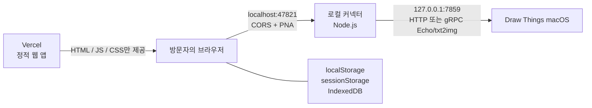

# Draw Things Local Canvas

Draw Things macOS의 로컬 API를 브라우저에서 사용하는 로컬 우선 AI 이미지 캔버스입니다. 웹 앱은 Vercel 같은 정적 호스팅에 둘 수 있지만, 프롬프트와 생성 이미지는 방문자의 브라우저와 그 Mac에서 실행 중인 Draw Things 사이에서만 이동합니다.

이 프로젝트의 API 매핑과 제약은 Draw Things `v1.20260716.0` (`64646d1202441d6abe17498caa02316669c3fc31`)을 기준으로 확인했습니다. Draw Things 공식 제품이나 공식 웹 클라이언트는 아닙니다.

## 핵심 기능

- 여러 로컬 세션을 가진 무한 캔버스: 이동, 확대/축소, 전체 맞춤, 이미지 가져오기
- Draw Things HTTP API의 `txt2img`·`img2img`, 네이티브 gRPC의 `txt2img`
- 선택한 캔버스 이미지를 다음 생성의 입력 이미지로 사용하는 변형 흐름
- 같은 세션의 이전 프롬프트를 이어 붙이는 클라이언트 측 대화 문맥
- Draw Things 소스에서 확인한 HTTP 생성 파라미터와 gRPC `GenerationConfiguration` 88개 슬롯 매핑
- 모델, 샘플링, 배치, SDXL, refiner, 고해상도 보정, 타일링, 비디오, LoRA, Control, 업스케일, 텍스트 인코더, TeaCache, CFG 등 범주별 전체 설정 UI
- 로컬에 실제 설치된 주 모델을 이름과 파일명으로 보여 주는 모델·refiner 드롭다운과 즉시 새로고침
- 연결 직전 검사와 지속적인 상태 감시
- HTTP·gRPC, 호스트, 포트, TLS, 공유 비밀, API base path, 커넥터 주소를 포함한 연결 설정
- 로컬 커넥터를 통한 루프백 자동 탐색과 gRPC Echo·모델 메타데이터 진단
- 모든 설정·세션·이미지의 브라우저 로컬 저장

## 아키텍처



Vercel 서버가 방문자의 `localhost`에 접속하는 구조가 아닙니다. 브라우저가 방문자 Mac의 루프백 커넥터에 직접 요청하고, 커넥터가 허용된 Draw Things API 경로만 중계합니다. 따라서 캔버스를 사용할 때 Draw Things와 커넥터가 모두 같은 Mac에서 실행 중이어야 합니다.

기본 Draw Things 서버에는 브라우저용 CORS 응답이 없고 네이티브 gRPC도 브라우저에서 직접 호출할 수 없으므로, 배포 환경에서는 로컬 커넥터 사용을 권장합니다.

## 요구 사항

- macOS와 Draw Things `v1.20260716.0` 또는 호환 버전
- Node.js `22.12.0` 이상
- pnpm `10.33.0`
- 로컬 네트워크 접근을 허용할 수 있는 최신 브라우저

Node와 pnpm 버전을 확인합니다.

```sh
node --version
pnpm --version
```

## 로컬 개발 빠른 시작

### 1. 의존성 설치

```sh
pnpm install --frozen-lockfile
```

### 2. Draw Things API 서버 설정

Draw Things의 설정에서 API 서버를 다음과 같이 맞춥니다.

| Draw Things 옵션 | 캔버스 생성용 권장값 | 설명 |
| --- | --- | --- |
| API 서버 | 켬 / Online | 꺼지면 웹 앱이 즉시 연결 끊김으로 표시합니다. |
| 프로토콜 | `HTTP` 또는 `gRPC` | HTTP는 txt2img/img2img, gRPC는 txt2img·실제 진행률·미리보기·취소를 지원합니다. |
| IP | `127.0.0.1` | 가능하면 루프백만 사용합니다. `0.0.0.0`은 LAN에도 노출될 수 있습니다. |
| 포트 | `7859` | 다른 포트도 지원하지만 웹 설정과 동일해야 합니다. |
| TLS | 끔 | 내장 HTTP API의 기본 구성입니다. |
| 공유 비밀 | 선택 | gRPC에서 켰다면 웹 연결에도 반드시 동일한 값을 입력합니다. 값이 없거나 다르면 생성을 광고하지 않습니다. |
| 브리지 모드 | 보통 끔 | Draw Things의 서버 오프로딩 기능이며 이 프로젝트의 로컬 커넥터와 다른 개념입니다. |
| 응답 압축 | 선택 | gRPC의 raw Float16 또는 FPZIP tensor 응답을 모두 PNG로 변환합니다. HTTP 생성에는 영향이 없습니다. |
| 모델 탐색 | 선택 | gRPC Echo 메타데이터로 설치 모델 드롭다운을 보강합니다. |

Draw Things를 `0.0.0.0`에 바인딩해도 웹 앱과 커넥터에는 호스트 `127.0.0.1`을 입력할 수 있습니다. 다만 이 경우 Draw Things 자체가 다른 네트워크 인터페이스에도 노출될 수 있으므로 macOS 방화벽을 함께 확인하십시오.

### 3. 웹 개발 서버 실행

터미널 하나에서 다음을 실행합니다.

```sh
pnpm dev
```

기본 주소는 `http://127.0.0.1:5173`입니다.

### 4. 로컬 커넥터 실행

다른 터미널에서 다음을 실행합니다.

```sh
pnpm bridge
```

개발 모드에서 `--origin`을 생략하면 정확히 다음 origin만 허용합니다.

- `http://localhost:5173`
- `http://127.0.0.1:5173`
- `http://[::1]:5173`
- 같은 호스트의 Vite preview 포트 `4173`

커넥터는 기본적으로 `http://127.0.0.1:47821`에만 바인딩합니다. `0.0.0.0`이나 LAN 주소로 커넥터를 열 수 없습니다.

### 5. 웹에서 연결

웹 앱의 **Draw Things 연결** 화면에서 다음 값을 선택합니다.

1. 연결 경로: `로컬 커넥터`
2. Draw Things 프로토콜: 앱 설정과 같은 `HTTP` 또는 `gRPC`
3. 호스트: `127.0.0.1`
4. 포트: `7859` 또는 Draw Things에서 선택한 포트
5. 커넥터 주소: `http://127.0.0.1:47821`
6. **연결 테스트** 후 **이 설정 사용**

**자동 찾기**는 입력한 포트와 기본 포트 `7859`에서 평문 HTTP, TLS gRPC, h2c gRPC를 병렬로 점검합니다. Bonjour로 앱을 실행하거나 시스템 설정을 변경하지는 않습니다.

## Tailscale로 모바일에서 접속

### Vercel 주소를 그대로 사용하는 경우

`https://...vercel.app`에서 접속한 브라우저는 Mac의 평문 `http://100.x.y.z` 커넥터를 안전하게 호출할 수 없습니다. Android의 `127.0.0.1`도 Mac이 아니라 Android 자신을 가리킵니다. 따라서 Vercel HTTPS와 Mac의 루프백 커넥터 사이에 Tailscale Serve HTTPS를 둡니다. 먼저 Tailscale을 최신 보안 버전으로 업데이트하고 MagicDNS 호스트 이름을 확인합니다.

```sh
/Applications/Tailscale.app/Contents/MacOS/Tailscale version
/Applications/Tailscale.app/Contents/MacOS/Tailscale status
```

Mac의 첫 번째 Terminal에서 배포 사이트 origin, 32자 이상의 토큰, 모바일에서 사용할 정확한 MagicDNS 주소를 지정해 커넥터를 실행합니다.

```sh
node ~/Downloads/draw-things-bridge.mjs \
  --origin https://your-site.vercel.app \
  --token '<64자리-무작위-16진수-토큰>' \
  --proxy-host your-mac.your-tailnet.ts.net:47822
```

두 번째 Terminal에서 기존 Serve 포트는 건드리지 않고 새 HTTPS 진입점만 추가합니다.

```sh
/Applications/Tailscale.app/Contents/MacOS/Tailscale serve \
  --bg --yes --https=47822 http://127.0.0.1:47821
```

Android의 Vercel 연결 화면에는 다음 값을 입력합니다.

| 모바일 연결 값 | 설정 |
| --- | --- |
| 연결 경로 | `로컬 커넥터` |
| 휴대폰용 커넥터 HTTPS 주소 | `https://your-mac.your-tailnet.ts.net:47822` |
| 커넥터 페어링 토큰 | Mac의 `--token`과 동일한 값 |
| Draw Things 프로토콜 | 앱 설정과 같은 `HTTP` 또는 `gRPC` |
| Draw Things 호스트 | `127.0.0.1` |
| Draw Things 포트 | Mac의 Draw Things API 포트 |

Android가 로컬 네트워크 접근 권한을 묻는다면 허용합니다. 모든 값은 해당 모바일 브라우저의 Local Storage에만 저장됩니다. 최초 저장 뒤에는 같은 브라우저에서 자동으로 다시 연결하고 5초마다 커넥터 상태를 확인합니다.

이 HTTPS 진입점만 제거하려면 `tailscale serve --https=47822 off`를 사용합니다. 다른 Serve 설정을 보존하려면 전체 `serve reset`은 사용하지 마십시오.

### 웹사이트도 Mac에서 직접 미리보기하는 경우

모바일과 Mac이 같은 tailnet에 연결되어 있으면 물리 LAN 전체가 아닌 **이 Mac의 실제 Tailscale IP에만** 웹 미리보기와 커넥터를 바인딩할 수 있습니다. `0.0.0.0`은 Wi-Fi·유선 LAN에도 노출되므로 사용하지 않습니다.

macOS 앱 번들에서 현재 Tailscale IPv4를 확인하고 프로덕션 빌드를 만듭니다.

```sh
/Applications/Tailscale.app/Contents/MacOS/Tailscale ip -4
pnpm build
```

터미널 하나에서 빌드 결과를 Tailscale IP의 5173 포트에만 엽니다.

```sh
DRAW_THINGS_TAILSCALE_IP=$(/Applications/Tailscale.app/Contents/MacOS/Tailscale ip -4)
pnpm exec vite preview \
  --host "$DRAW_THINGS_TAILSCALE_IP" \
  --port 5173 \
  --strictPort
```

다른 터미널에서 웹 origin과 충분히 긴 페어링 토큰을 지정해 커넥터를 실행합니다.

```sh
DRAW_THINGS_TAILSCALE_IP=$(/Applications/Tailscale.app/Contents/MacOS/Tailscale ip -4)
node public/bridge/draw-things-bridge.mjs \
  --bind "$DRAW_THINGS_TAILSCALE_IP" \
  --origin "http://$DRAW_THINGS_TAILSCALE_IP:5173" \
  --token '<64자리-무작위-16진수-토큰>'
```

모바일에서 `http://<Mac의-Tailscale-IP>:5173`을 열고 다음처럼 연결합니다.

| 모바일 연결 값 | 설정 |
| --- | --- |
| 연결 경로 | `로컬 커넥터` |
| Draw Things 프로토콜 | 앱 설정과 같은 `HTTP` 또는 `gRPC` |
| Draw Things 호스트 | `127.0.0.1` — 모바일 주소로 바꾸지 않음 |
| Draw Things 포트 | Mac의 Draw Things API 포트 |
| 커넥터 주소 | `http://<Mac의-Tailscale-IP>:47821` |
| 커넥터 페어링 토큰 | 위 `--token`과 동일한 값 |

Tailscale 주소로 처음 열면 커넥터 주소와 `--bind` 실행 명령을 UI가 자동 제안합니다. 모바일 origin의 Local Storage·IndexedDB는 Mac의 `127.0.0.1:5173`과 별개이므로 연결 설정과 캔버스도 따로 저장됩니다. 제한적인 tailnet 정책을 사용한다면 해당 모바일 기기에서 Mac의 TCP `5173`, `47821` 접근을 허용해야 합니다. 인터넷 공유기 포트 포워딩은 필요하지 않습니다.

## 배포용 커넥터

배포 빌드에는 단일 실행 파일 `public/bridge/draw-things-bridge.mjs`가 포함됩니다. FPZIP WASM도 이 파일 안에 내장되어 별도 런타임 파일이나 추가 npm 의존성이 없습니다. 소스 트리에서는 다음 명령으로 갱신합니다.

```sh
pnpm bridge:build
```

배포된 웹 앱의 연결 화면에서 커넥터를 다운로드하거나 다음과 같이 저장할 수 있습니다.

```sh
curl -fLo ~/Downloads/draw-things-bridge.mjs https://your-site.vercel.app/bridge/draw-things-bridge.mjs
```

운영 사이트의 정확한 origin을 허용해 실행합니다. URL 끝에 경로나 `/`를 붙이지 않습니다.

```sh
node ~/Downloads/draw-things-bridge.mjs \
  --origin https://your-site.vercel.app
```

Vercel preview URL과 운영 URL을 모두 사용할 때는 `--origin`을 반복합니다.

```sh
node ~/Downloads/draw-things-bridge.mjs \
  --origin https://your-site.vercel.app \
  --origin https://your-preview.vercel.app
```

origin은 와일드카드를 지원하지 않습니다. 새 preview URL이 생기면 해당 origin을 추가하고 커넥터를 다시 실행해야 합니다.

### 페어링 토큰

정확한 origin 제한만으로도 다른 웹사이트의 접근을 차단하지만, 운영 환경에서는 페어링 토큰을 함께 사용하는 것을 권장합니다. 웹 연결 화면의 **실행 명령 복사**는 강한 무작위 토큰을 자동으로 포함합니다.

```sh
node ~/Downloads/draw-things-bridge.mjs \
  --origin https://your-site.vercel.app \
  --token '<긴-랜덤-토큰>'
```

웹 연결 설정의 커넥터 페어링 토큰 값도 동일해야 합니다. 커넥터는 `Authorization: Bearer`, `X-Draw-Things-Bridge-Token`, `X-Draw-Things-Pairing-Token`을 지원합니다. 토큰은 최소 6자이지만 충분히 긴 무작위 값을 권장합니다.

전체 CLI 옵션은 다음 명령으로 확인합니다.

```sh
node ~/Downloads/draw-things-bridge.mjs --help
```

Draw Things의 **외부 모델 폴더**를 사용하면 읽을 폴더를 커넥터에 명시합니다. 이 경로는 웹 앱에 저장되거나 전송되지 않고 해당 커넥터 프로세스만 읽습니다. 옵션은 여러 번 지정할 수 있습니다.

```sh
node ~/Downloads/draw-things-bridge.mjs \
  --origin https://your-site.vercel.app \
  --token '<긴-랜덤-토큰>' \
  --models-dir '/Volumes/AI Models/Draw Things'
```

## Vercel 배포

이 프로젝트는 서버 함수가 없는 Vite 정적 앱입니다. `vercel.json`에 SPA rewrite와 CSP·보안 헤더가 포함되어 있습니다.

Vercel 프로젝트 설정은 다음과 같습니다.

| 항목 | 값 |
| --- | --- |
| Framework Preset | Vite |
| Install Command | `pnpm install --frozen-lockfile` |
| Build Command | `pnpm build` |
| Output Directory | `dist` |
| Node.js | `22.12.0` 이상 |

Vercel CLI로 배포하려면 다음을 실행합니다.

```sh
pnpm dlx vercel
pnpm dlx vercel --prod
```

배포 후에는 최종 도메인을 커넥터의 `--origin`에 정확히 넣어 다시 실행하십시오. 커넥터 자체는 Vercel에 배포하지 않으며 각 사용자의 Mac에서 실행합니다.

## 연결 옵션과 동작

| 옵션 | 지원 범위 |
| --- | --- |
| 로컬 커넥터 | 권장 경로. Vercel HTTPS 페이지와 Draw Things 루프백 API 사이를 중계합니다. |
| 직접 연결 | CORS를 추가한 사용자 프록시나 수정된 HTTP 서버에서만 실용적으로 동작합니다. Vercel HTTPS 배포에서는 혼합 콘텐츠 정책상 사용자 프록시도 HTTPS여야 합니다. 기본 Draw Things에서는 실패합니다. |
| HTTP | 연결 검사, `/sdapi/v1/options`, `txt2img`, `img2img`를 지원합니다. |
| gRPC | 커넥터를 통한 TLS/h2c Echo, 공유 비밀, gzip gRPC framing, 모델 메타데이터, `txt2img`, 실제 signpost 진행률·미리보기·취소, raw/FPZIP tensor→PNG 변환을 지원합니다. `img2img`와 이미지 힌트 기반 ControlNet/IP-Adapter는 아직 지원하지 않습니다. |
| 호스트 | 커넥터 경로는 `localhost`, `127.0.0.1`, `::1`만 허용합니다. 직접 연결은 사용자 지정 프록시 주소를 입력할 수 있습니다. |
| 포트 | `1`–`65535`. Draw Things 기본값은 `7859`, 커넥터 기본값은 `47821`입니다. |
| TLS | gRPC 또는 사용자 HTTPS 프록시 진단에 사용합니다. Draw Things 자체 서명 인증서는 커넥터 안에서만 처리됩니다. |
| 공유 비밀 | Draw Things gRPC에서 공유 비밀을 켠 경우 동일 값을 입력합니다. HTTP 생성 인증 수단은 아닙니다. |
| API Base Path | 기본 Draw Things에서는 비워 둡니다. 경로 prefix가 있는 사용자 프록시에서만 사용합니다. |
| 클라이언트 이름 | gRPC Echo와 GenerateImage의 클라이언트 식별 값입니다. |
| 앱 서버 기대값 | Draw Things의 브리지 모드, 응답 압축, 모델 탐색 설정을 기록하는 UI 값입니다. 웹 앱이 Draw Things 설정을 원격으로 켜거나 끄지는 않습니다. |

브라우저 보안 정책 때문에 로컬 네트워크 권한 안내가 나타날 수 있습니다. 권한을 거부하면 `로컬 네트워크 권한 거부됨`으로 즉시 구분해 표시합니다. HTTP 오류 응답을 받은 경우에는 권한 문제로 오인하지 않고 인증/API 불일치 상태를 유지합니다. 브라우저 설정에서 이 사이트의 로컬 네트워크 권한을 허용한 뒤 다시 테스트하십시오.

## 연결 상태 감시

- 저장된 Draw Things 연결은 화면이 보일 때 5초마다 검사합니다.
- 백그라운드 탭에서는 25초마다 검사합니다.
- 탭이 다시 보이면 즉시 한 번 더 검사합니다.
- 이미지 생성 직전에도 반드시 실시간 연결 검사를 수행합니다.
- 생성 중에는 긴 작업과 충돌하지 않도록 일반 heartbeat를 잠시 멈춥니다.
- 로컬 커넥터 자체의 health는 별도로 5초마다 확인합니다.
- 일반 연결 실패가 누적되면 `degraded`에서 `offline`으로 바뀌며, API 불일치와 CORS/TLS 차단은 즉시 구분합니다.

새 연결을 저장한 뒤 처음 받은 `/sdapi/v1/options` 응답을 한 번만 로컬 UI에 병합합니다. 이후 heartbeat는 사용자가 바꾼 생성값을 덮지 않습니다.

## 이미지 생성과 세션 문맥

HTTP 모드에서 프롬프트와 네거티브 프롬프트는 Draw Things의 `txt2img` 또는 `img2img` 요청으로 전달됩니다. 캔버스에서 이미지를 선택하고 **선택 이미지로 변형**을 켜면 선택 이미지의 원본 크기와 base64 데이터를 `init_images`로 전송합니다.

gRPC 모드의 `txt2img`는 공식 `imageService.proto`와 `config.fbs`를 기준으로 요청을 만들고, 서버 스트림의 signpost와 preview를 NDJSON 이벤트로 전달합니다. 최종 NNC tensor는 커넥터 안에서 공식 범위 `(value + 1) × 127.5`로 RGB에 복원한 뒤 PNG로 바뀝니다. 4채널 결과는 Draw Things의 ARGB 순서에 맞춰 RGB를 복원하고 `[0, 1]` alpha도 투명도로 보존합니다. 응답 압축을 껐을 때의 raw Float16과 켰을 때의 FPZIP을 모두 처리합니다. 브라우저 이미지를 NNC Float16 tensor로 올리는 gRPC `img2img`와 hint/content tensor가 필요한 ControlNet/IP-Adapter는 실제 앱 검증 전까지 비활성화되어 있으며 이 경우 HTTP 모드를 사용해야 합니다.

대화 문맥은 Draw Things 서버 세션이 아니라 이 웹 앱의 로컬 기능입니다.

- **대화 문맥 이어짐**이 켜져 있으면 같은 캔버스 세션의 직전 유효 프롬프트 뒤에 새 입력을 붙입니다.
- 프롬프트를 `!`로 시작하면 그 요청에서만 이전 문맥을 제외합니다.
- 다른 캔버스 세션의 문맥은 섞이지 않습니다.
- 요청·응답 상태와 생성 이미지 lineage는 해당 로컬 세션에 기록됩니다.

## 설치 모델 목록과 모델 설치

Draw Things의 HTTP `/sdapi/v1/options`는 현재 선택된 모델 하나만 반환합니다. 전체 드롭다운이 필요할 때 로컬 커넥터는 Draw Things의 `custom.json`, 공식·비공식 모델 카탈로그를 읽고, 주 모델 파일이 실제로 존재하며 비어 있지 않은 항목만 병합합니다. VAE·CLIP·T5 같은 의존 파일은 생성 모델 목록에서 제외하며 절대 로컬 경로는 브라우저에 보내지 않습니다. gRPC와 모델 탐색이 켜진 환경에서는 Echo의 모델 메타데이터도 함께 병합합니다. 앱의 로컬 `configs.json` 캐시가 있으면 현재 모델과 선택 LoRA에 맞는 네이티브 권장 설정도 함께 제공하며, 모델 유형이 바뀔 때만 사용자가 적용 여부를 선택합니다.

현재 공개 HTTP API에는 모델 검색·다운로드·변환·설치·삭제 경로가 없습니다. gRPC에는 다음 저수준 파일 동기화 RPC가 있지만 이 커넥터는 둘 다 웹에 노출하지 않습니다.

- `FilesExist`: 파일명 목록과 선택적 해시를 보내 Draw Things 저장소의 존재 여부·해시를 확인합니다.
- `UploadFile`: 양방향 스트림의 첫 메시지로 `filename`·SHA-256·`totalSize`를 보내고, 이후 `filename`·`offset`·`content` 청크를 순서대로 전송합니다. 서버는 `.part` 파일을 만든 뒤 크기와 SHA-256을 확인하고 최종 파일을 교체합니다.

`UploadFile`은 이미 Draw Things와 호환되는 파일을 복사하는 기능일 뿐, 모델 검색, safetensors 변환, 모델 사양 등록, 라이선스 확인, VAE·CLIP·T5 의존 파일 해결까지 수행하는 “모델 설치 API”가 아닙니다. `GenerateImage`의 `MetadataOverride`도 해당 요청 중 Zoo 메타데이터 해석을 덮는 값이며 영구 설치 명령이 아닙니다.

이를 브라우저에 그대로 열면 임의 파일명·대용량 업로드에 따른 경로 조작, 기존 파일 덮어쓰기, 디스크 고갈, 악성/호환되지 않는 모델 투입 위험이 있습니다. 향후 지원하려면 basename/확장자 allowlist, 경로 정규화와 symlink 방어, 파일·전체 저장소 quota와 여유 공간 검사, 고정 최대 크기, 청크 offset·최종 SHA-256 재검증, 원자적 이동, 동시성·속도 제한, 공유 비밀과 커넥터 토큰, 명시적 로컬 사용자 확인이 먼저 필요합니다. 현재는 Draw Things의 **모델 관리/가져오기**에서 설치한 뒤 웹 앱의 모델 새로고침을 누르십시오.

## 로컬 데이터와 개인정보 보호

이 프로젝트에는 사용자 프롬프트나 이미지를 받는 애플리케이션 백엔드, 계정, 쿠키, 분석 SDK가 없습니다.

| 저장소 | 저장 내용 |
| --- | --- |
| `localStorage` | 연결 설정, 생성 설정, 네거티브 프롬프트, UI 설정, 활성 세션 ID. `기억`을 켠 공유 비밀과 페어링 토큰도 포함될 수 있습니다. |
| `sessionStorage` | `기억`을 끈 공유 비밀. 현재 탭 세션 동안만 유지됩니다. |
| `IndexedDB` | 캔버스 세션·대화·위치 메타데이터와 가져온/생성 이미지 data URL을 분리된 object store에 저장합니다. |
| 메모리 | 진행 중 요청과 미리보기 상태. |

브라우저 저장소는 암호화 금고가 아닙니다. 같은 브라우저 프로필을 사용할 수 있는 사람과 권한이 강한 브라우저 확장은 값을 읽을 수 있습니다. 민감한 공유 비밀은 **이 브라우저에 기억**을 끄고, 공용 Mac에서는 사용 후 해당 사이트의 브라우저 데이터를 삭제하십시오.

세션 삭제 버튼은 해당 세션과 이미지를 IndexedDB에서 함께 삭제합니다. 전체 데이터를 지우려면 브라우저의 해당 사이트 저장 데이터에서 Local Storage와 IndexedDB를 삭제하십시오.

## 로컬 커넥터 보안 모델

커넥터는 범용 프록시가 되지 않도록 다음을 강제합니다.

- 기본은 `127.0.0.1`에만 listen; 원격 모드는 명시한 Tailscale IPv4/IPv6만 허용
- Tailscale bind에서는 명시적 origin과 32자 이상 페어링 토큰 필수
- 요청 `Host`가 실제 커넥터 bind 주소와 포트인지 검증
- Draw Things 대상도 `localhost`, `127.0.0.1`, `::1`로 제한
- 정확히 일치하는 origin만 CORS 허용; 와일드카드 없음
- Private Network Access preflight 응답 지원
- 정해진 `/v1/*` 라우트와 HTTP method만 허용
- 선택적 페어링 토큰을 상수 시간 비교로 검증
- 제어 요청 256 KiB, 생성 요청 128 MiB, upstream 응답 512 MiB 제한
- JSON prototype 오염 키와 과도한 중첩 거부
- 연결·생성 timeout 및 동시 연결 제한
- 오류 응답에서 공유 비밀을 제거

운영 사이트의 코드가 바뀌면 그 사이트는 사용자의 로컬 커넥터에 요청할 수 있습니다. 신뢰하는 배포만 `--origin`에 추가하고, 가능하면 자신의 Vercel 프로젝트에 배포해 사용하십시오.

## 중요한 API 한계

### 브라우저와 Vercel

- 원격 Vercel 서버는 방문자 Mac의 `localhost`에 도달할 수 없습니다.
- 기본 Draw Things HTTP 서버는 CORS preflight를 제공하지 않습니다.
- `mode: no-cors` 요청으로는 JSON 이미지 응답을 읽을 수 없으므로 해결책이 아닙니다.
- 웹 앱이 Draw Things를 실행하거나 macOS 설정을 자동 변경할 수 없습니다. 자동 연결은 실행 중인 커넥터와 알려진 루프백 포트를 탐색하는 범위입니다.

### HTTP 생성

Draw Things `v1.20260716.0`의 공개 HTTP surface는 사실상 다음 네 경로입니다.

- `GET /`
- `GET /sdapi/v1/options`
- `POST /sdapi/v1/txt2img`
- `POST /sdapi/v1/img2img`

생성 요청은 동기식입니다. 서버가 실제 단계별 진행률, 중간 미리보기, 서버 측 취소 API를 제공하지 않습니다. 커넥터의 진행 표시는 연결이 살아 있음을 알리는 heartbeat이며 실제 diffusion 진행률이 아닙니다. 중단 버튼은 브라우저와 커넥터의 요청을 끊지만 Draw Things 내부 생성 작업은 완료될 때까지 계속될 수 있습니다.

HTTP `img2img`는 `init_images` 한 장만 받으며 입력 이미지 크기가 `width`와 `height`에 정확히 일치해야 합니다. HTTP 경로에는 마스크 업로드가 없어 실제 mask inpaint는 지원하지 않습니다. 텍스트 생성 크기는 Draw Things 블록 크기에 맞춰 64의 배수로 제한합니다.

### gRPC

브라우저는 Draw Things의 네이티브 HTTP/2 gRPC와 직접 통신할 수 없습니다. 로컬 커넥터가 TLS 또는 h2c 세션, 인증서 pinning, 공유 비밀, Protobuf framing을 처리합니다. `Echo`를 통한 연결·모델 탐색과 서버 스트리밍 `GenerateImage`의 `txt2img`를 지원합니다.

생성 설정은 Draw Things `v1.20260716.0`의 88-slot `GenerationConfiguration` FlatBuffer로 인코딩됩니다. 결과는 raw Float16 또는 FPZIP NNC tensor로 수신해 브라우저 PNG로 바꾸며, 4 MiB 서버 청크도 이미지별로 제한을 두고 결합합니다. 실제 sampling signpost, RGB 중간 preview, 전송 크기를 스트리밍하고 HTTP/2 stream 취소를 서버에 전달합니다. 모델별 디코더가 필요한 4채널 이상의 latent preview는 RGB로 오인해 네온/반전 색상처럼 표시하거나 생성을 중단하지 않도록 생략합니다. 공유 비밀이 필요한 서버에서 Echo가 `sharedSecretMissing=true`를 반환하면 올바른 비밀을 다시 입력할 때까지 생성과 모델 탐색을 비활성화합니다.

현재 gRPC `img2img`와 입력 기반 ControlNet/IP-Adapter는 지원하지 않습니다. 공식 입력 형식은 68-byte NNC header 뒤 NHWC Float16 tensor이며 image, hint, content 필드와 alpha/mask 처리가 함께 필요합니다. 이 변환을 실제 Draw Things에서 검증하기 전까지 지원한다고 광고하지 않으며, 이미지 변형과 제어 이미지는 HTTP 모드를 사용합니다. gRPC 출력 안전 한도는 축당 4096px이며 UI와 생성 전 검증에도 같은 한도를 표시합니다.

## `v1.20260716.0`에서 확인한 upstream API 문제

웹 앱은 다음 문제를 숨기지 않고 UI 또는 요청 sanitizer에서 우회합니다.

| 필드/기능 | upstream 동작 | 이 프로젝트의 처리 |
| --- | --- | --- |
| `stage_2_steps` | 파라미터 객체는 존재하지만 `allParameters()` 목록에서 빠져 있어 HTTP JSON으로 보내면 422가 발생합니다. | HTTP 요청에서는 제외하고 gRPC FlatBuffer slot 50에서는 기본값 10을 포함해 지원합니다. |
| `compression_artifacts` | canonical key와 alias가 중복되어 HTTP decode가 422를 반환합니다. | HTTP에서는 읽기 전용/요청 제외, gRPC slot 84에서는 지원합니다. |
| `compression_artifacts_quality` | 같은 중복 alias 문제로 422가 발생합니다. | HTTP에서는 읽기 전용/요청 제외, gRPC slot 85에서는 지원합니다. |
| `color_calibration` | 같은 중복 alias 문제로 422가 발생합니다. | HTTP에서는 읽기 전용/요청 제외, gRPC slot 86에서는 지원합니다. |
| `expand_prompt_to_json` | 같은 중복 alias 문제로 422가 발생합니다. | HTTP에서는 읽기 전용/요청 제외, gRPC slot 87에서는 지원합니다. |
| `tea_cache_end` | options 기본값은 `-1`인데 HTTP validator는 `0...1000`만 허용합니다. | 값이 음수이면 요청에서 생략합니다. |
| `separate_t5`, `t5_text` | 소스의 기본값 참조가 다른 필드를 가리키는 문제가 있습니다. | 연결 후 `/options`에서 받은 서버 값을 우선합니다. |
| `restore_faces` / `face_restoration` | HTTP는 요청 전용 bool `restore_faces`, gRPC config slot 22는 얼굴 복원 모델 파일명 `face_restoration`을 사용합니다. | 프로토콜에 따라 bool 또는 모델 파일명 입력을 각각 노출하고 다른 프로토콜의 필드는 요청에서 제외합니다. |
| mask inpaint | HTTP 서버가 mask 이미지를 decode하지 않습니다. | 지원하지 않는 것으로 명시합니다. |

Draw Things 버전을 올린 뒤 이 문제가 수정되었다면 `src/lib/draw-things/parameters.ts`의 호환 처리와 테스트를 함께 갱신해야 합니다.

## 테스트와 품질 검사

개발 중 빠른 단위 테스트 watch:

```sh
pnpm test
```

개별 검사:

```sh
pnpm lint
pnpm typecheck
pnpm test:run
pnpm bridge:build
pnpm build
```

전체 정적 검사·단위 테스트·프로덕션 빌드:

```sh
pnpm check
```

브라우저 E2E 테스트를 처음 실행하기 전 Chromium을 설치합니다.

```sh
pnpm exec playwright install chromium
pnpm test:e2e
```

커넥터 테스트에는 origin·토큰·Private Network Access, body 제한, 루프백 host 제한, HTTP/gRPC probe, 88-slot FlatBuffer, Protobuf streaming frame, raw Float16/FPZIP 색상 복원, ARGB alpha PNG encoding, 청크 결합, 취소 경합, 단일 파일 번들 검증이 포함됩니다. 실제 이미지 생성 품질과 모델 호환성은 사용자의 Draw Things 버전과 설치 모델에 따라 달라지므로 실제 앱에서도 최종 확인해야 합니다. 내장 FPZIP의 출처·SHA-256·BSD-3 고지는 [`THIRD_PARTY_NOTICES.md`](THIRD_PARTY_NOTICES.md)에 있습니다.

## 공식 기준 소스

아래 링크는 문서 작성 당시 검증한 release와 정확한 commit에 고정되어 있습니다.

- [Draw Things Community release `v1.20260716.0`](https://github.com/drawthingsai/draw-things-community/releases/tag/v1.20260716.0)
- [기준 commit `64646d1202441d6abe17498caa02316669c3fc31`](https://github.com/drawthingsai/draw-things-community/commit/64646d1202441d6abe17498caa02316669c3fc31)
- [HTTP route와 txt2img/img2img 처리 — `HTTPAPIServer.swift`](https://github.com/drawthingsai/draw-things-community/blob/64646d1202441d6abe17498caa02316669c3fc31/Libraries/HTTPAPIServer/Sources/HTTPAPIServer.swift)
- [HTTP request/response decode — `ServerModels.swift`](https://github.com/drawthingsai/draw-things-community/blob/64646d1202441d6abe17498caa02316669c3fc31/Libraries/HTTPAPIServer/Sources/ServerModels.swift)
- [파라미터 정의와 `allParameters()` — `Parameters.swift`](https://github.com/drawthingsai/draw-things-community/blob/64646d1202441d6abe17498caa02316669c3fc31/Libraries/Invocation/Sources/Parameters.swift)
- [gRPC service 구현 — `ImageGenerationServiceImpl.swift`](https://github.com/drawthingsai/draw-things-community/blob/64646d1202441d6abe17498caa02316669c3fc31/Libraries/GRPC/Server/Sources/ImageGenerationServiceImpl.swift)
- [gRPC image service protobuf — `imageService.proto`](https://github.com/drawthingsai/draw-things-community/blob/64646d1202441d6abe17498caa02316669c3fc31/Libraries/GRPC/Models/Sources/imageService/imageService.proto)
- [88-slot FlatBuffer 설정 — `config.fbs`](https://github.com/drawthingsai/draw-things-community/blob/64646d1202441d6abe17498caa02316669c3fc31/Libraries/DataModels/Sources/config.fbs)
- [공식 원격 gRPC 클라이언트 — `RemoteImageGenerator.swift`](https://github.com/drawthingsai/draw-things-community/blob/64646d1202441d6abe17498caa02316669c3fc31/Libraries/RemoteImageGenerator/Sources/RemoteImageGenerator.swift)
- [공식 tensor→RGB 범위 변환 — `ImageConverter.swift`](https://github.com/drawthingsai/draw-things-community/blob/64646d1202441d6abe17498caa02316669c3fc31/Libraries/LocalImageGenerator/Sources/ImageConverter.swift)
- [Draw Things 공식 문서](https://docs.drawthings.ai/)
