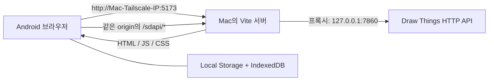

# Draw Things Local Canvas

Draw Things macOS의 HTTP API를 같은 Mac에서 실행되는 웹 서버가 중계하는 로컬 우선 AI 이미지 캔버스입니다. Android에서는 Mac의 Tailscale IP로 웹 서버에 접속합니다. 프롬프트와 생성 이미지는 애플리케이션 백엔드로 전송되지 않습니다.

이 프로젝트의 API 매핑과 제약은 Draw Things `v1.20260716.0` (`64646d1202441d6abe17498caa02316669c3fc31`)을 기준으로 확인했습니다. Draw Things 공식 제품이나 공식 웹 클라이언트는 아닙니다.

## 현재 구조



브라우저는 항상 상대 경로 `/sdapi`만 호출합니다. 개발 서버와 preview 서버가 그 요청을 `http://127.0.0.1:7860`으로 전달하므로 CORS, 혼합 콘텐츠, 별도 페어링 과정이 없습니다.

Vercel 배포는 UI를 확인하는 정적 preview/안내 페이지입니다. Vercel에는 Mac으로 요청을 전달할 로컬 프록시가 없으며 `/sdapi`도 SPA rewrite에서 제외되어 있으므로 **Vercel 주소에서는 실제 이미지 생성이 동작하지 않습니다.** 실제 생성은 `http://<Mac의-Tailscale-IP>:5173`에서 사용합니다.

## 기능

- 여러 로컬 세션을 가진 무한 캔버스: 이동, 확대/축소, 전체 맞춤, 이미지 가져오기
- Draw Things HTTP `txt2img`와 `img2img`
- 선택한 캔버스 이미지를 다음 생성의 입력으로 사용하는 변형 흐름
- 같은 세션의 이전 프롬프트를 이어 붙이는 클라이언트 측 대화 문맥
- 모델, 샘플러, 크기, 스텝, CFG, 시드, SDXL, refiner, 고해상도 보정, 타일링, LoRA, Control, 업스케일, 텍스트 인코더, TeaCache 등 HTTP API 생성 설정
- `/sdapi/v1/options`에서 확인한 현재 모델 표시와 새로고침
- 5초 간격 연결 감시, 탭 복귀 시 즉시 확인, 생성 직전 재검사
- 설정은 Local Storage 시작 캐시와 IndexedDB revision 트랜잭션에, 캔버스 세션과 이미지는 IndexedDB에 로컬 저장

## 요구 사항

- macOS와 Draw Things `v1.20260716.0` 또는 호환 버전
- Node.js `22.12.0` 이상
- pnpm `10.33.0`
- Mac과 Android에 로그인된 Tailscale

```sh
node --version
pnpm --version
/Applications/Tailscale.app/Contents/MacOS/Tailscale version
```

## Draw Things 설정

Draw Things의 설정에서 API 서버를 다음과 같이 맞춥니다.

| 옵션 | 값 | 이유 |
| --- | --- | --- |
| API 서버 | 켬 / Online | 웹 서버의 상태 확인과 생성을 받습니다. |
| 프로토콜 | `HTTP` | 브라우저 클라이언트가 사용하는 공개 API입니다. |
| IP | `127.0.0.1` | Draw Things 자체를 LAN이나 tailnet에 직접 노출하지 않습니다. |
| 포트 | `7860` | Vite 프록시의 고정 대상입니다. |
| TLS | 끔 | Mac 내부 루프백 통신입니다. |

포트·호스트·HTTP TLS를 다르게 사용하려면 실행할 때 서버 측 환경 변수로 origin을 지정합니다.

```sh
DRAW_THINGS_API_ORIGIN=https://127.0.0.1:7861 pnpm dev
```

자체 서명 인증서를 쓰는 로컬 HTTPS API라면 신뢰할 인증서를 설치하는 것이 우선입니다. 테스트 목적으로만
`DRAW_THINGS_API_TLS_VERIFY=false`를 함께 지정할 수 있습니다. 브라우저가 직접 네이티브 gRPC를 호출할
수는 없으므로 이 단순 서버는 Draw Things의 HTTP 모드만 지원합니다.

## Mac에서 실행

의존성을 설치합니다.

```sh
pnpm install --frozen-lockfile
```

Mac에서만 개발할 때는 다음으로 충분합니다.

```sh
pnpm dev
```

기본 주소는 `http://127.0.0.1:5173`입니다. 이 상태에서는 다른 기기에 포트가 열리지 않습니다.

## Tailscale로 Android에서 접속

프로덕션 빌드를 만든 뒤 Vite preview를 **Mac의 Tailscale IP에만** 바인딩합니다.
API는 기본적으로 Mac 자신에게만 열립니다. Android의 Tailscale IP를 허용 목록에 넣어 실행하세요.

```sh
pnpm build
DRAW_THINGS_TAILSCALE_IP=$(/Applications/Tailscale.app/Contents/MacOS/Tailscale ip -4)
DRAW_THINGS_ANDROID_TAILSCALE_IP=100.64.0.2
DRAW_THINGS_ALLOWED_CLIENTS="$DRAW_THINGS_ANDROID_TAILSCALE_IP" pnpm preview -- \
  --host "$DRAW_THINGS_TAILSCALE_IP" \
  --port 5173 \
  --strictPort
```

위 `100.64.0.2`는 예시이므로 `tailscale status`에 표시되는 Android의 실제 IP로 바꿉니다.
여러 기기를 허용하려면 `DRAW_THINGS_ALLOWED_CLIENTS`에 쉼표로 구분해 입력합니다. 허용하지 않은
tailnet 기기는 웹 화면을 열 수 있어도 `/sdapi`의 프롬프트를 읽거나 생성을 실행할 수 없습니다.
MagicDNS 이름으로 접속할 때만 그 이름을 `DRAW_THINGS_ALLOWED_HOSTS`에 추가합니다. IP 주소로 접속할
때는 설정할 필요가 없습니다. 이 호스트 검사로 DNS rebinding을 통한 API 호출도 차단합니다.

Android에서 다음 주소를 엽니다.

```text
http://<Mac의-Tailscale-IP>:5173
```

예를 들어 Mac IP가 `100.121.194.59`라면 `http://100.121.194.59:5173`입니다. 별도의 API 주소나 인증 값을 입력하지 않아도 화면이 열리면 자동으로 `/sdapi/v1/options`를 검사합니다.

연결되지 않을 때는 다음을 확인합니다.

1. Android와 Mac이 같은 tailnet에서 온라인인지 확인합니다.
2. Draw Things가 `HTTP / 127.0.0.1 / 7860`으로 실행 중인지 확인합니다.
3. preview 터미널이 계속 실행 중인지 확인합니다.
4. 제한적인 Tailscale ACL/grant를 사용한다면 Android에서 Mac의 TCP `5173` 접근을 허용합니다.
5. 브라우저의 기존 Vercel 탭이 아니라 `http://<Mac-IP>:5173`을 열었는지 확인합니다.

`--host 0.0.0.0`은 Wi-Fi와 유선 LAN에도 서버를 노출하므로 사용하지 마십시오. 인터넷 공유기 포트 포워딩도 필요하지 않습니다.

## Vercel 배포

Vercel에는 서버 함수가 없는 Vite 정적 앱만 배포됩니다. UI 확인, 프로젝트 안내, 최신 프런트엔드 배포 확인에 사용할 수 있지만 로컬 Draw Things 생성 경로는 제공하지 않습니다.

| Vercel 설정 | 값 |
| --- | --- |
| Framework Preset | Vite |
| Install Command | `pnpm install --frozen-lockfile` |
| Build Command | `pnpm build` |
| Output Directory | `dist` |
| Node.js | `22.12.0` 이상 |

```sh
pnpm dlx vercel
pnpm dlx vercel --prod
```

`vercel.json`은 `/sdapi` 요청을 `index.html`로 rewrite하지 않습니다. 따라서 Vercel에서 API 요청이 잘못 성공한 것처럼 보이지 않고 명확히 실패합니다.

## 연결 상태 감시

- 앱 시작 직후 `GET /sdapi/v1/options`를 검사합니다.
- 생성 중이 아닐 때 5초마다 검사합니다.
- 탭이 다시 보이면 즉시 한 번 더 검사합니다.
- 이미지 생성 직전에도 반드시 실시간 검사를 수행합니다.
- 생성 중에는 동기식 생성 요청과 충돌하지 않도록 일반 heartbeat를 잠시 멈춥니다.
- 실패가 누적되면 `degraded`에서 `offline`으로 전환하고 화면에 바로 표시합니다.

처음 받은 options 값은 생성 설정에 한 번 병합합니다. 이후 heartbeat는 사용자가 바꾼 값을 덮지 않습니다.

## 이미지 생성과 세션 문맥

텍스트 생성은 `POST /sdapi/v1/txt2img`, 선택 이미지 변형은 `POST /sdapi/v1/img2img`를 사용합니다. img2img는 선택 이미지의 원본 크기와 base64 데이터를 `init_images`로 전송합니다.

현재 버전은 Draw Things HTTP API가 반환한 최종 PNG/JPEG 계열 이미지만 사용합니다. 이전 네이티브
텐서 디코딩 경로는 제거했으므로 그 경로에서 나타났던 색 반전·검은 화면·네온 노이즈를 다시
해석하지 않습니다. 빈 문자열인 `upscaler`도 요청에서 제외해 의도하지 않은 업스케일을 막습니다.

대화 문맥은 Draw Things 서버 세션이 아니라 웹 앱의 로컬 기능입니다.

- **대화 문맥 이어짐**이 켜져 있으면 같은 캔버스 세션의 직전 유효 프롬프트 뒤에 새 입력을 붙입니다.
- 프롬프트를 `!`로 시작하면 그 요청에서만 이전 문맥을 제외합니다.
- 다른 캔버스 세션의 문맥은 섞이지 않습니다.
- 요청·응답 상태와 생성 이미지 lineage는 해당 로컬 세션에 기록됩니다.

## 모델 목록과 설치

공개 HTTP API의 `/sdapi/v1/options`는 현재 선택된 모델 하나만 반환합니다. 따라서 웹의 모델 선택에는 현재 모델만 표시되며, 전체 설치 모델 카탈로그를 제공하지 않습니다.

모델을 바꾸거나 새로 설치하려면 Draw Things의 **모델 관리/가져오기**를 사용한 뒤 웹에서 **현재 모델 다시 확인**을 누르십시오. 공개 HTTP API에는 모델 검색, 다운로드, 변환, 설치, 삭제 경로가 없습니다.

## 로컬 데이터

이 프로젝트에는 프롬프트나 이미지를 수신하는 애플리케이션 백엔드, 계정, 쿠키, 분석 SDK가 없습니다.

| 저장소 | 저장 내용 |
| --- | --- |
| `localStorage` | revision이 포함된 생성/UI 설정의 빠른 시작 캐시 |
| `IndexedDB` | 생성/UI 설정의 원본, 캔버스 세션, 대화, 위치 메타데이터, 가져온 이미지와 생성 이미지 |
| 메모리 | 진행 중인 요청 상태 |

세션 삭제 버튼은 해당 세션과 이미지를 IndexedDB에서 함께 삭제합니다. 전체 데이터를 지우려면 브라우저의 해당 사이트 저장 데이터에서 Local Storage와 IndexedDB를 삭제하십시오. `127.0.0.1`, Tailscale IP, Vercel은 서로 다른 origin이므로 각각 별도의 브라우저 저장소를 가집니다.

API 상태 창의 **백업 내보내기**와 **백업 가져오기**로 설정·대화·캔버스 이미지를 한 JSON 파일로
옮길 수 있습니다. 기존 Vercel origin의 작업을 보존하려면 Vercel 주소에서 백업을 내려받고,
`http://<Mac의-Tailscale-IP>:5173`에서 가져오면 됩니다. 백업 파일은 서버로 업로드되지 않고 현재
브라우저가 직접 읽어 IndexedDB 트랜잭션에 기록하고 Local Storage 캐시를 갱신합니다. 다른 탭에서
가져오기 전 상태를 계속 편집하더라도 revision 검사로 새 캔버스를 덮어쓰지 못합니다.

## 로컬 API 보호 한도

Mac의 웹 서버는 Draw Things 앞에서 다음을 강제합니다.

- 허용된 Tailscale 클라이언트 또는 Mac 자신만 `/sdapi` 사용
- `GET /sdapi/v1/options`, `POST /sdapi/v1/txt2img`, `POST /sdapi/v1/img2img`만 허용
- 생성 요청 본문 최대 128 MiB, 동시 생성 1건
- 불완전한 본문 업로드 제한시간, `Expect`/chunked 요청 거부
- options 응답 최대 2 MiB, 생성 응답 최대 128 MiB
- 한 요청당 이미지 최대 4개, 총 출력 픽셀 최대 `4096 × 4096`
- 개별 너비·높이 128–4096

Android의 Tailscale IP가 바뀌면 새 IP로 `DRAW_THINGS_ALLOWED_CLIENTS`를 갱신하고 preview를 다시
시작해야 합니다. Tailscale ACL/grant에서도 Android만 Mac의 TCP 5173에 접근하도록 제한하면 보호가
한 겹 더 생깁니다.

## HTTP API 한계

Draw Things `v1.20260716.0`의 공개 HTTP surface는 다음 네 경로입니다.

- `GET /`
- `GET /sdapi/v1/options`
- `POST /sdapi/v1/txt2img`
- `POST /sdapi/v1/img2img`

생성 요청은 동기식입니다. 실제 단계별 진행률, 중간 미리보기, 서버 측 취소 API가 없습니다. **중단**은
결과를 캔버스에 추가하지 않도록 표시하지만, 작업이 끝날 때까지 HTTP 연결과 단일 생성 잠금을 유지해
다음 요청이 겹치지 않게 합니다. 탭을 닫거나 네트워크가 끊기면 브라우저 연결은 끝나도 Draw Things
내부 작업은 계속될 수 있습니다.

HTTP `img2img`는 `init_images` 한 장만 받으며 입력 이미지 크기가 `width`와 `height`에 정확히 일치해야 합니다. HTTP 경로에는 마스크 이미지 업로드가 없어 mask inpaint는 지원하지 않습니다. 텍스트 생성 크기는 Draw Things 블록 크기에 맞춰 64의 배수로 제한합니다.

다음 upstream 필드는 현재 HTTP decoder 제약 때문에 요청에서 제외됩니다.

| 필드 | 처리 |
| --- | --- |
| `stage_2_steps` | `allParameters()`에서 빠져 있어 HTTP 요청에서 제외 |
| `compression_artifacts` | 중복 alias로 422가 발생해 제외 |
| `compression_artifacts_quality` | 중복 alias로 422가 발생해 제외 |
| `color_calibration` | 중복 alias로 422가 발생해 제외 |
| `expand_prompt_to_json` | 중복 alias로 422가 발생해 제외 |
| `tea_cache_end` | 음수 기본값이면 validator 범위를 벗어나므로 제외 |

## 테스트

```sh
pnpm lint
pnpm typecheck
pnpm test:run
pnpm build
pnpm check
```

브라우저 E2E 테스트를 처음 실행하기 전 Chromium을 설치합니다.

```sh
pnpm exec playwright install chromium
pnpm test:e2e
```

## 공식 기준 소스

- [Draw Things Community release `v1.20260716.0`](https://github.com/drawthingsai/draw-things-community/releases/tag/v1.20260716.0)
- [기준 commit `64646d1202441d6abe17498caa02316669c3fc31`](https://github.com/drawthingsai/draw-things-community/commit/64646d1202441d6abe17498caa02316669c3fc31)
- [HTTP route와 txt2img/img2img 처리 — `HTTPAPIServer.swift`](https://github.com/drawthingsai/draw-things-community/blob/64646d1202441d6abe17498caa02316669c3fc31/Libraries/HTTPAPIServer/Sources/HTTPAPIServer.swift)
- [HTTP request/response decode — `ServerModels.swift`](https://github.com/drawthingsai/draw-things-community/blob/64646d1202441d6abe17498caa02316669c3fc31/Libraries/HTTPAPIServer/Sources/ServerModels.swift)
- [파라미터 정의와 `allParameters()` — `Parameters.swift`](https://github.com/drawthingsai/draw-things-community/blob/64646d1202441d6abe17498caa02316669c3fc31/Libraries/Invocation/Sources/Parameters.swift)
- [Draw Things 공식 문서](https://docs.drawthings.ai/)
